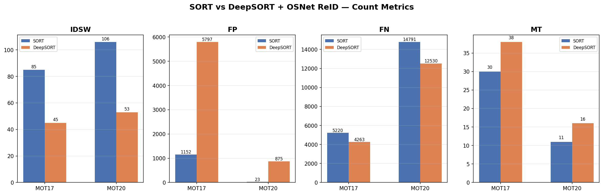
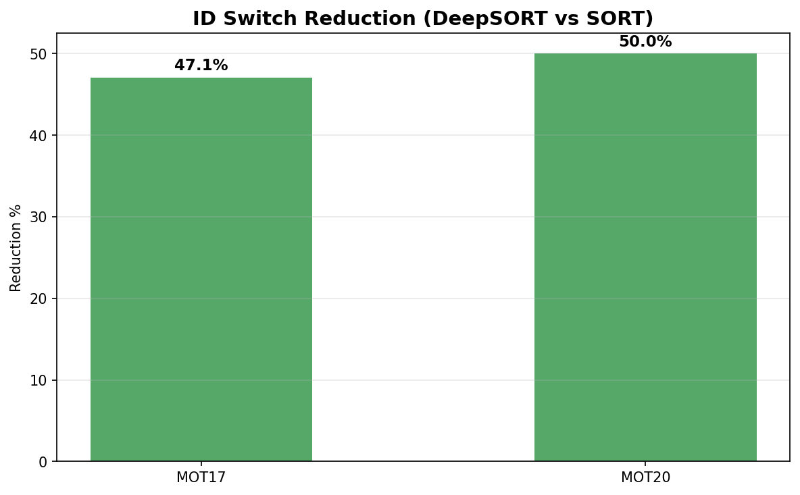

# RetailHeat

Multi-object tracking and heatmap generation pipeline for retail customer flow analysis. Combines YOLOv8 detection with SORT and DeepSORT tracking to produce density heatmaps from surveillance footage.

## Features

- **YOLOv8x** person detection with configurable confidence thresholds
- **SORT** baseline tracker (IoU-based association)
- **DeepSORT** tracker with our pretrained [OSNet ReID model](https://huggingface.co/MYerassyl/retail-heat-osnet) for appearance-based matching
- **Heatmap generation** using kernel density estimation
- **MOT metrics** evaluation (MOTA, IDF1, ID switches)
- **Ablation studies** comparing SORT vs DeepSORT and ReID model variants

## Setup

```bash
git clone https://github.com/MYerassyl/retail-heat.git
cd retail-heat
pip install -r requirements.txt
```

### Download our pretrained ReID model from HuggingFace

```bash
mkdir -p weights
pip install huggingface_hub
huggingface-cli download MYerassyl/retail-heat-osnet osnet_x1_0_market1501.pth --local-dir weights/
```

The YOLOv8x detector weights are downloaded automatically on first run.

## Usage

### Run the full SORT baseline pipeline

```bash
python run_pipeline.py
```

### Run the DeepSORT pipeline

```bash
python run_pipeline_deepsort.py
```

### Run on MOT20 sequences

```bash
python run_pipeline_mot20.py
```

### Compare SORT vs DeepSORT

```bash
python compare.py
```

### ReID model ablation study

```bash
python ablation_reid.py
```

## Sample Output

| SORT Heatmap | DeepSORT Heatmap | Ground Truth |
|:---:|:---:|:---:|
|  |  |  |
|  |  |  |

### Comparison Charts

| Metric | Chart |
|:---:|:---:|
| Count Metrics |  |
| Heatmap Quality |  |
| ID Switch Reduction |  |

## Project Structure

```
retail-heat/
├── config.py                  # Central configuration
├── detect.py                  # YOLOv8 person detection
├── track.py                   # SORT tracker
├── deepsort_tracker.py        # DeepSORT tracker
├── reid_embedder.py           # OSNet ReID feature extractor
├── heatmap.py                 # KDE heatmap generation
├── evaluate.py                # MOT metrics evaluation
├── evaluate_heatmaps.py       # Heatmap quality metrics
├── compare.py                 # SORT vs DeepSORT comparison
├── ablation_reid.py           # ReID model ablation study
├── visualize.py               # Visualization utilities
├── run_pipeline.py            # SORT baseline pipeline
├── run_pipeline_deepsort.py   # DeepSORT pipeline
├── run_pipeline_mot20.py      # MOT20 pipeline
├── sort_tracker.py            # SORT implementation
├── track_deepsort.py          # DeepSORT tracking logic
├── utils.py                   # Shared utilities
├── requirements.txt           # Python dependencies
└── weights/                   # Model weights (download separately)
```

## Model

Our pretrained OSNet x1.0 model for person re-identification is hosted on HuggingFace:

**[MYerassyl/retail-heat-osnet](https://huggingface.co/MYerassyl/retail-heat-osnet)**

- 2.2M parameters, 512-D L2-normalized embeddings
- Trained on Market-1501 (94.2% Rank-1 accuracy)
- Lightweight enough for real-time tracking

## License

MIT
