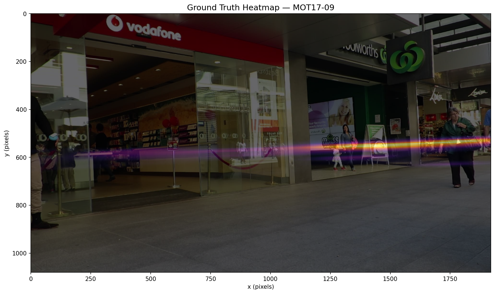
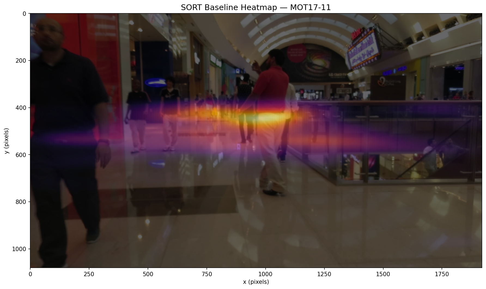
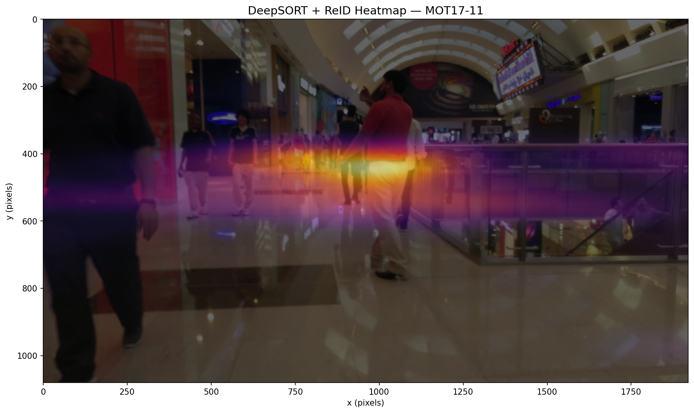
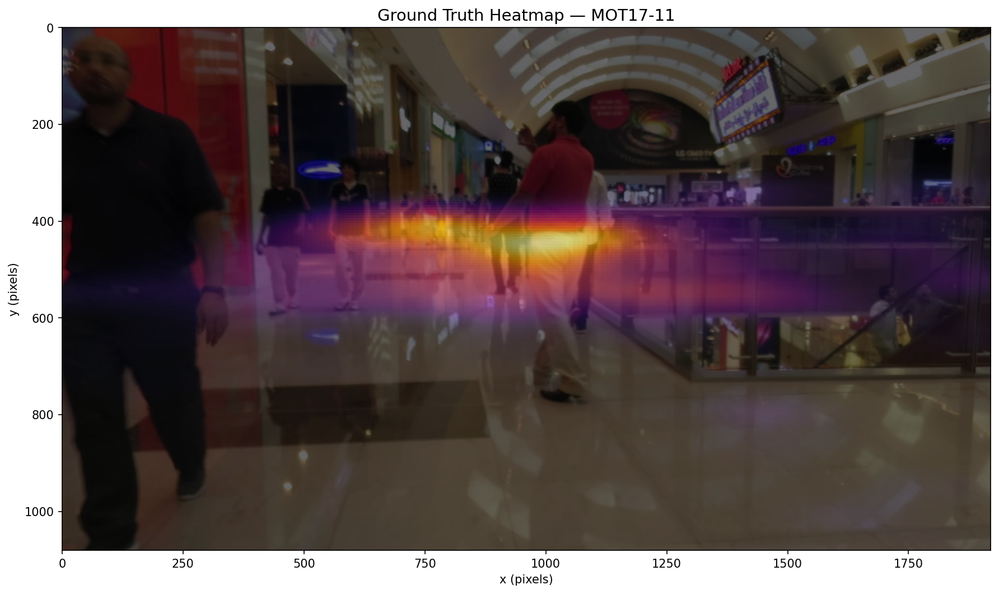
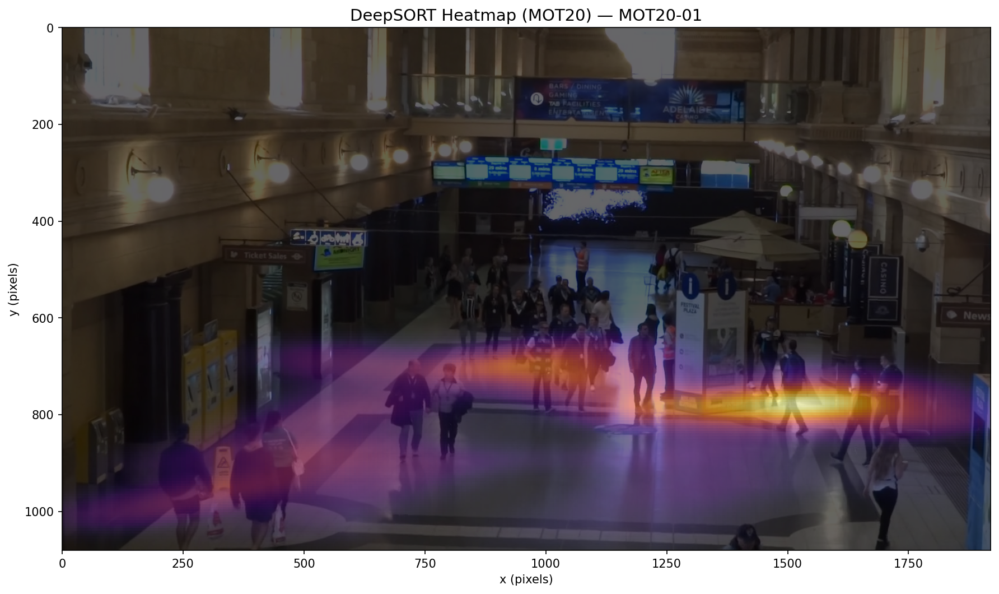
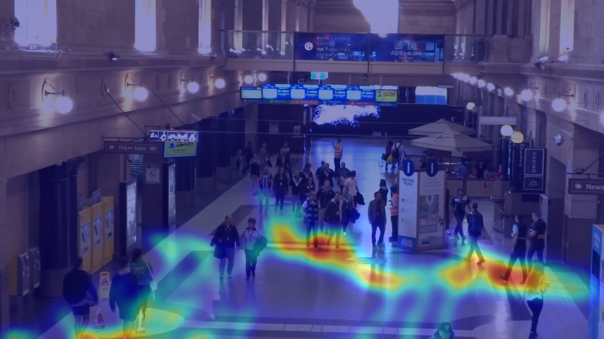
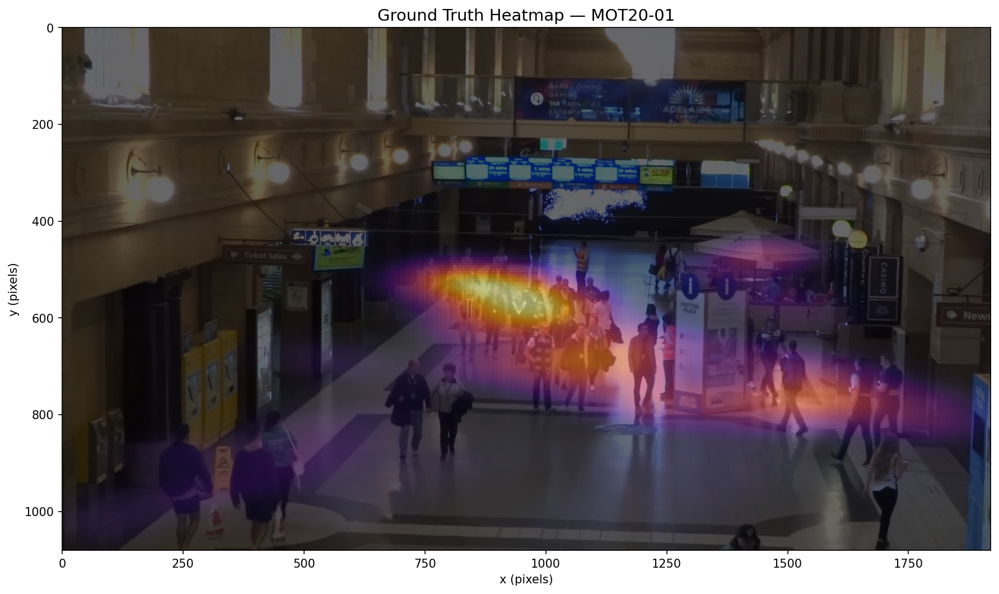
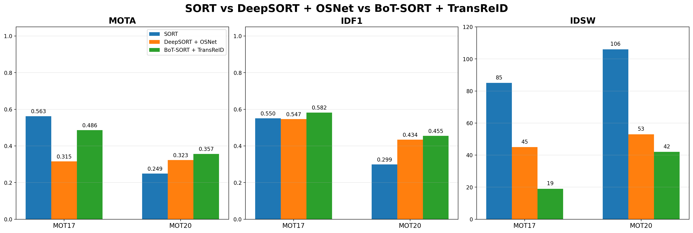
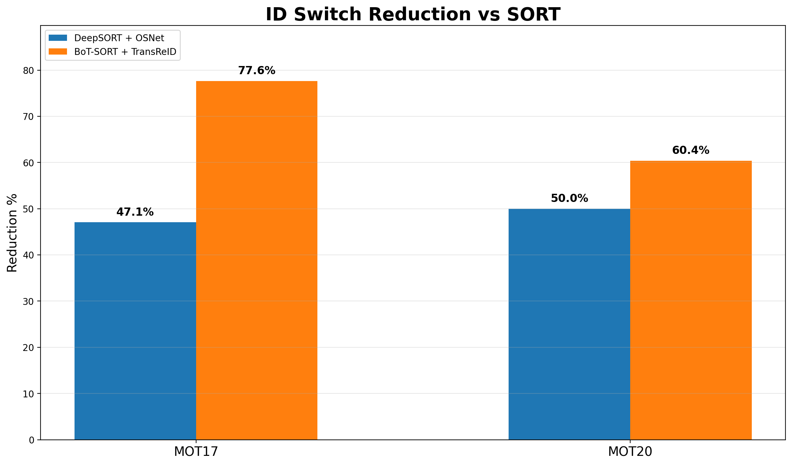
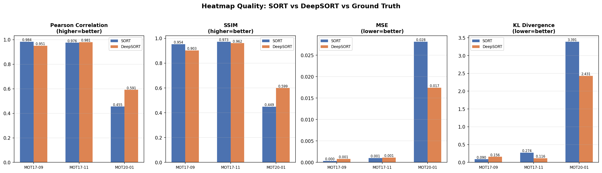

# RetailHeat

Multi-object tracking and heatmap generation pipeline for retail customer flow analysis. Combines YOLOv8 detection with SORT, DeepSORT, and BoT-SORT + TransReID tracking to produce density heatmaps from surveillance footage.

## Features

- **YOLOv8x** person detection with configurable confidence thresholds
- **SORT** baseline tracker (IoU-based association)
- **DeepSORT** tracker with our pretrained [OSNet ReID model](https://huggingface.co/MYerassyl/retail-heat-osnet) for appearance-based matching
- **BoT-SORT + TransReID** final tracker using transformer-based ReID embeddings from our Market-1501 fine-tuned model
- **Heatmap generation** using kernel density estimation
- **MOT metrics** evaluation (MOTA, IDF1, ID switches)
- **Ablation studies** comparing SORT, DeepSORT, and BoT-SORT tracker variants

## Setup

```bash
git clone https://github.com/MYerassyl/retail-heat.git
cd retail-heat
pip install -r requirements.txt
```

### Download our pretrained ReID models from Hugging Face

```bash
mkdir -p weights
pip install huggingface_hub
huggingface-cli download MYerassyl/retail-heat-osnet osnet_x1_0_market1501.pth --local-dir weights/
huggingface-cli download nursultanmldev/retail-heat-transreid transformer_120.pth --local-dir weights/
```

The YOLOv8x detector weights are downloaded automatically on first run.

## Usage

### Run the full SORT baseline pipeline

```bash
python run_pipeline.py
```

### Run the DeepSORT pipeline

```bash
python run_pipeline_deepsort.py
```

### Run on MOT20 sequences

```bash
python run_pipeline_mot20.py
```

### Compare SORT vs DeepSORT

```bash
python evaluation/compare.py
```

### ReID model ablation study

```bash
python evaluation/ablation_reid.py
```

### BoT-SORT + TransReID training and evaluation

The full BoT-SORT + TransReID workflow is included in:

```text
training/bot-sort/retail-heat-bot-sort.ipynb
```

## Final BoT-SORT + TransReID Results

| Benchmark | Pipeline | MOTA | IDF1 | IDSW |
|:---:|:---|---:|---:|---:|
| MOT17 | SORT | 0.5626 | 0.5504 | 85 |
| MOT17 | DeepSORT + OSNet | 0.3154 | 0.5466 | 45 |
| MOT17 | BoT-SORT + TransReID | 0.485799 | 0.582232 | 19 |
| MOT20 | SORT | 0.2491 | 0.2987 | 106 |
| MOT20 | DeepSORT + OSNet | 0.3227 | 0.4340 | 53 |
| MOT20 | BoT-SORT + TransReID | 0.356668 | 0.454978 | 42 |

BoT-SORT + TransReID delivers the strongest **IDF1** on both reported benchmarks and cuts ID switches substantially relative to the SORT baseline.

## Sample Output

### Baseline examples

| SORT Heatmap | DeepSORT Heatmap | Ground Truth |
|:---:|:---:|:---:|
|  |  |  |
|  |  |  |

### BoT-SORT + TransReID example (MOT20-01)

| DeepSORT Heatmap | BoT-SORT + TransReID Heatmap | Ground Truth |
|:---:|:---:|:---:|
|  |  |  |

### Comparison Charts

| Metric | Chart |
|:---:|:---:|
| Tracking Metrics |  |
| ID Switch Reduction |  |
| Heatmap Quality (SORT vs DeepSORT) |  |

## Project Structure

```text
retail-heat/
├── config.py                     # Central configuration
├── utils.py                      # Shared utilities
├── detection/
│   ├── __init__.py
│   └── detect.py                 # YOLOv8 person detection
├── tracking/
│   ├── __init__.py
│   ├── sort_tracker.py           # SORT algorithm
│   ├── deepsort_tracker.py       # DeepSORT wrapper
│   ├── reid_embedder.py          # OSNet ReID feature extractor
│   ├── track.py                  # SORT tracking orchestrator
│   └── track_deepsort.py         # DeepSORT tracking orchestrator
├── evaluation/
│   ├── __init__.py
│   ├── evaluate.py               # MOT metrics
│   ├── evaluate_heatmaps.py      # Heatmap quality metrics
│   ├── heatmap.py                # KDE heatmap generation
│   ├── compare.py                # SORT vs DeepSORT comparison
│   ├── visualize.py              # Video rendering
│   └── ablation_reid.py          # ReID model ablation study
├── training/
│   └── bot-sort/
│       └── retail-heat-bot-sort.ipynb
├── docs/
│   ├── REPORT.md
│   └── MODEL_EXPLANATION.md
├── run_pipeline.py               # SORT baseline pipeline
├── run_pipeline_deepsort.py      # DeepSORT pipeline
├── run_pipeline_mot20.py         # MOT20 pipeline
├── run_pipeline_boxmot.py        # BoxMOT multi-tracker pipeline
├── requirements.txt              # Python dependencies
└── weights/                      # Model weights (download separately)
```

## Models

### OSNet x1.0

**[MYerassyl/retail-heat-osnet](https://huggingface.co/MYerassyl/retail-heat-osnet)**

- 2.2M parameters, 512-D L2-normalized embeddings
- Trained on Market-1501 (94.2% Rank-1 accuracy)
- Lightweight enough for real-time tracking

### TransReID final model for BoT-SORT

**[nursultanmldev/retail-heat-transreid](https://huggingface.co/nursultanmldev/retail-heat-transreid)**

- Transformer-based ReID model fine-tuned on Market-1501
- Used as the appearance encoder in the BoT-SORT final pipeline
- Trained for 120 epochs

## License

MIT

Final BoT-SORT + TransReID model: https://huggingface.co/nursultanmldev/retail-heat-transreid
